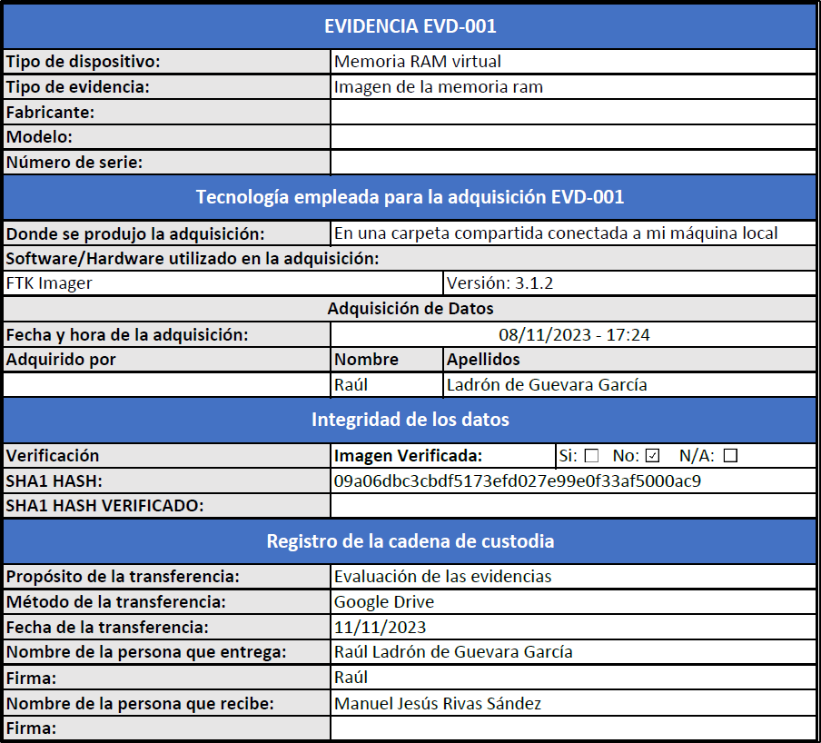

# Proyecto 2: Incident Investigation


Autor: Raúl Ladrón de Guevara García

## Índice

1. [Introducción](#introducción)
2. [Identificación](#identificación)
3. [Adquisición](#adquisición)

    3.1. [En vivo](#en-vivo)

    3.2. [Post-mortem](#post-mortem)

4. [Preservación](#preservación)
5. [Documentación](#documentación)
6. [Análisis y presentación](#análisis-y-presentación)
7. [Metodología utilizada](#metodología-utilizada)

## Introducción

A lo largo de este proyecto realizaré las fases de recolección y almacenamiento de las evidencias encontradas en una máquina virtual de windows 7 professional que ha sufrido un incidente siguiendo cada una de las fases de la metodología de mi empresa para mantener en todo momento la integridad de las mismas. 

## Identificación:

En primer lugar, comenzaré identificando la fuente de evidencias de la que voy a realizar la recolección de evidencias.

Se trata de una máquina virtual de windows 7 professional con las siguientes características:

- Sistema operativo: Windows 7 professional
- Nº de procesadores: 1
- Tamaño del disco: 32GB
- Memoria ram: 1GB
- Tipo de sistema: 64 bits

## Adquisición:

Una vez identificada la fuente de evidencias, procedo a realizar la adquisición. 

Empiezo preparando mi memoria USB con todas las herramientas y comandos que voy a utilizar para realizar la adquisición de dicha máquina virtual:


En cuanto al almacenamiento de las evidencias, las almacenaré en una carpeta compartida conectada a mi máquina local, aunque no sea lo recomendable ya que no dispongo de otra opción. Los puertos de la máquina virtual solo aceptan 2.0 y tanto mi disco duro externo como mi portátil solo disponen de puertos 3.0 en adelante por lo que la máquina virtual no puede detectarlo.

### En vivo

Como primer paso apunto la hora y fecha para dejar constancia de la hora a la que se empezó a realizar la adquisición:

- Fecha: 08/11/2023 
- Hora: 17:20

#### Memoria volátil

##### Memoria ram

La primera adquisición que he realizado siguiendo el orden de volatilidad de la metodología es la memoria ram. Esta adquisición se ha realizado el día 8 de Noviembre de 2023 a las 17:24 con la ayuda de la herramienta FTK Imager. 

Proceso:

Para ello, pulso en el botón de capturar memoria. Selecciono el destino (En este caso, lo subo a una carpeta compartida para que se almacene directamente en la máquina local), indico el nombre del fichero y también le indico que incluya el fichero de paginación:


Proceso:


Una vez acabada la adquisición de memoria, me dirijo al directorio donde se la he almacenado y con ayuda de la herramienta 7zip (Ya estaba instalado en la máquina virtual) calculo el hash de dicha evidencia:


##### Información del sistema y de la red

Una vez capturada la memoria, procedo a capturar información sobre el sistema y la red a día 8 de Noviembre de 2023 a las 17:34 con la ayuda de los siguientes comandos:

``` bash
((date /t) & (time /t)) > systemdate.txt # Fecha y hora del sistema.

(systeminfo | find “Boot time”) > systeminfo.txt # Hora de inicio del sistema

tasklist > procesos.txt # Procesos

arp -a > ArpCache.txt # Arp Caché

ipconfig /all > red.txt # Configuración de red 

netstat -nr >> red.txt # Tabla de enrutamiento

nbtstat -c >> red.txt # Tabla de nombres NetBIOS

```
Ejecuto los comandos:


Y compruebo que se han almacenado correctamente:


##### Triage

El siguiente paso que realizo es el triage con la ayuda de la herramienta WINTRIAGE el día 8 de Noviembre de 2023 a las 17:43. 

Para ello especifico los módulos siguientes:


Selecciono el destino (En este caso, lo subo a una carpeta compartida para que se almacene directamente en la máquina local):


Selecciono que lo haga de forma comprimida y que genere el hash:


Una vez terminado el proceso, se almacena en el directorio especificado tanto como los datos de triage como el hash:


##### Memoria no volátil

Una vez realizada la adquisición de la memoria volátil, procedo a realizar la adquisición del disco duro de la máquina virtual a día 8 de Noviembre a las 18:04.

Para realizar dicha adquisición, utilizo la herramienta FTK Imager. 

Para ello accedo al programa, pulso en "File" y en "Create disk image":


Le indico que se trata de un dispositivo físico:


Selecciono el disco principal de máquina virtual:


Marco las casillas mostradas en la captura para que se verifique la imagen después de crearla y para que me muestre estadísticas durante el proceso y, por último, pulso en "add":


Selecciono que la imagen será de tipo "raw (dd)":


Configuro la información de la evidencia:


Le indico el directorio de destino (En este caso, lo subo a una carpeta compartida para que se almacene directamente en la máquina local), el nombre que tendrá la imagen y que la imagen no se fragmente estableciendo el valor en 0:


Una vez realizada toda la configuración, inicio el proceso de adquisición:


Cuando la imagen haya sido creada, empezará a verificarse como le especificamos anteriormente:


Una vez finalizado todo el proceso, nos muestra el resultado de la verificación y cómo podemos ver los hashes coinciden y no hay ningún bloque defectuoso:


Además, del informe de la imagen:


#### Post-mortem

Una vez realizada la adquisición en vivo, procedo a realizar la adquisición post-mortem a día 10 de Noviembre de 2023 a las 16:16.

Para realizar la adquisición post-mortem de la máquina virtual, he creado una imagen con la ayuda de la herramienta FTK Imager de toda la carpeta de la máquina virtual (Incluye disco duro, memoria, cache, logs...). Para ello, he añadido mi disco duro en el programa y he seleccionado la carpeta de la máquina virtual, he pulsado clic derecho y en "Add to Custom Content Image". Una vez añadida la carpeta, pulso en "Create image":


Le indico que verifique la imagen, que me muestre las estadísticas durante el proceso y, por último, pulso en "Add" para configurar la imagen:


Configuro la información de la evidencia:


Selecciono el destino donde se almacenará, le indico el nombre y la fragmentación y la compresión la dejo por defecto:


Una vez configurada la imagen, inicio el proceso:


Terminado el proceso, la imagen empieza a verificarse:


y como se puede ver se ha verificado correctamente:


Por último, compruebo que se ha almacenado correctamente junto las demás evidencias:


## Preservación

En este caso, las evidencias se han almacenado en una carpeta compartida a mi máquina local ya que no dispongo otra opción viable como expliqué en la fase de adquisición, pero no es lo más recomendable. 

Lo más recomendable seria almacenar las evidencias en un disco duro externo a ser posible mecánico y este almacenarlo en un soporte seguro como una caja apantallada libre de interferencias y guardarlo en un lugar seguro como una caja fuerte. Además, para ello deberemos llevar una indumentaria adecuada para no interferir en las evidencias recolectadas.

## Documentación

En este caso, ya he ido documentando todo el proceso siguiendo una línea temporal, por lo que reflejaré la descripción de todas las evidencias obtenidas durante la fase de adquisición, tecnologías utilizadas en la adquisición, el hash de las evidencias y además, la cadena de custodia de las mismas como indica la metodología utilizada.

Memoria RAM:



Triage:


Disco duro:


Post-mortem:


## Análisis y Presentación

Las fases de análisis y presentación se realizarán en las siguientes partes del proyecto por lo que las explicaré brevemente:

En cuanto a la fase de análisis, llevaremos a cabo una serie de procesos y tareas con las que intentaremos dar respuesta a la vulnerabilidad que estamos investigando.

En la fase de presentación, realizaremos un informe detallado de todo el proceso realizado en un lenguaje entendible para un público no técnico y lo presentaremos al profesor.


## Metodología utilizada

La metodología que he seguido durante todo el proyecto es la metodología que creé junto a mi grupo (grupo 3) en el primer proyecto de la asignatura de análisis forense informático.

Link metodología: https://github.com/IES-Rafael-Alberti/G3-ANALISIS-FORENSE/blob/main/P01_G3.md#desarrollo-de-metodolog%C3%ADa-propia