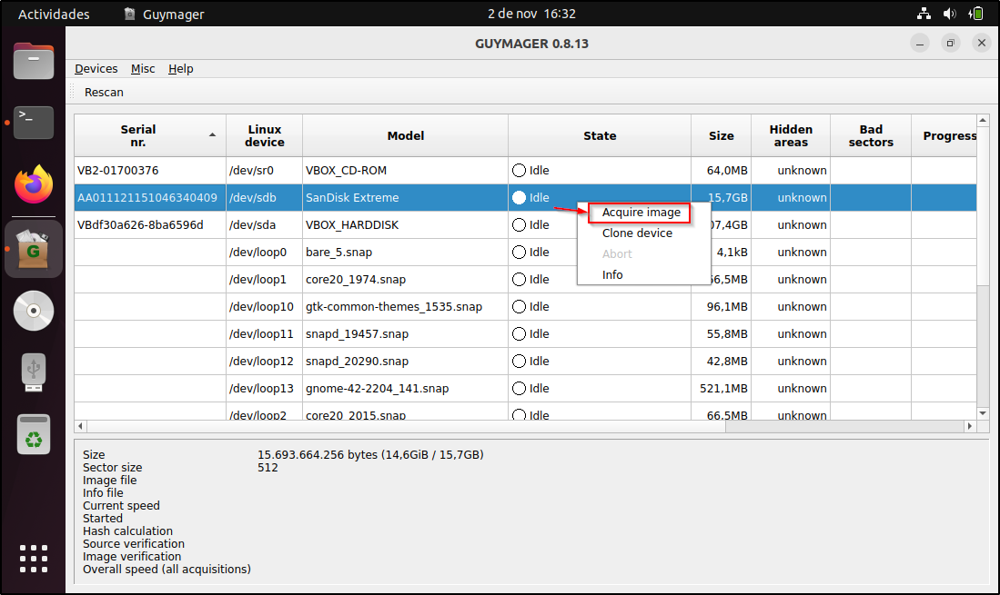
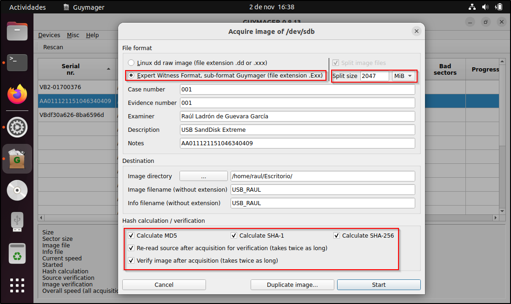
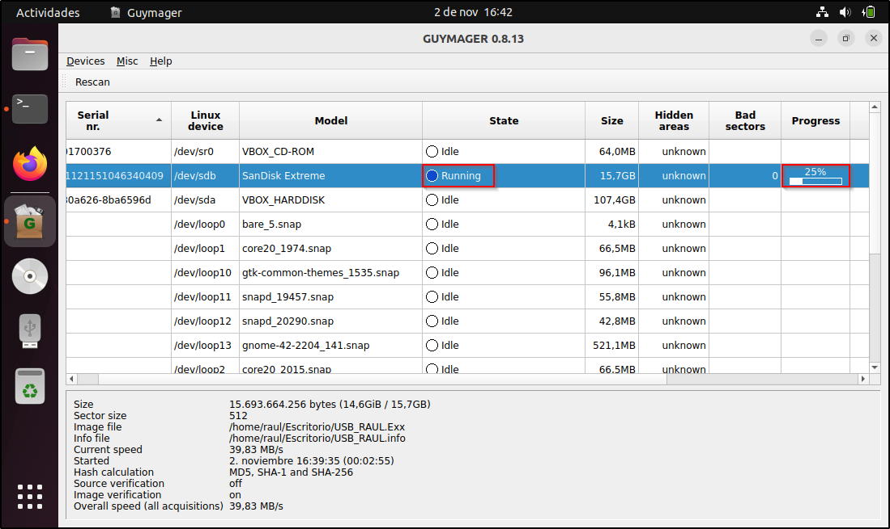
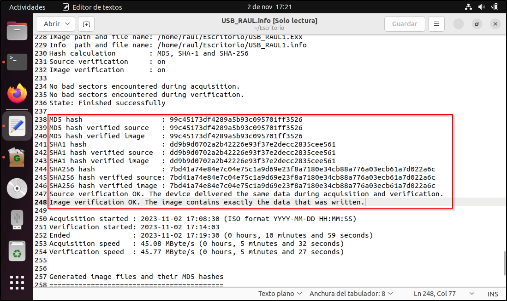
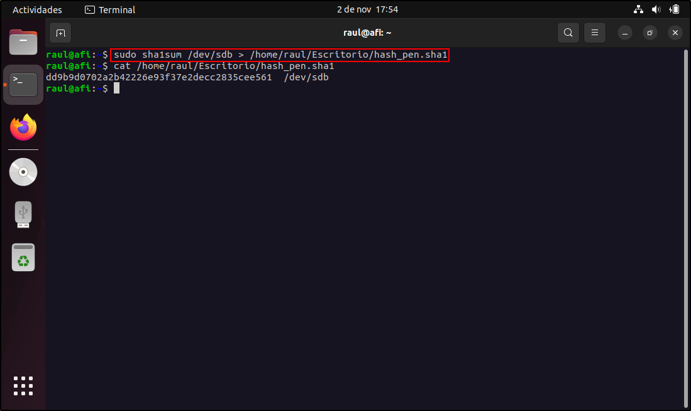
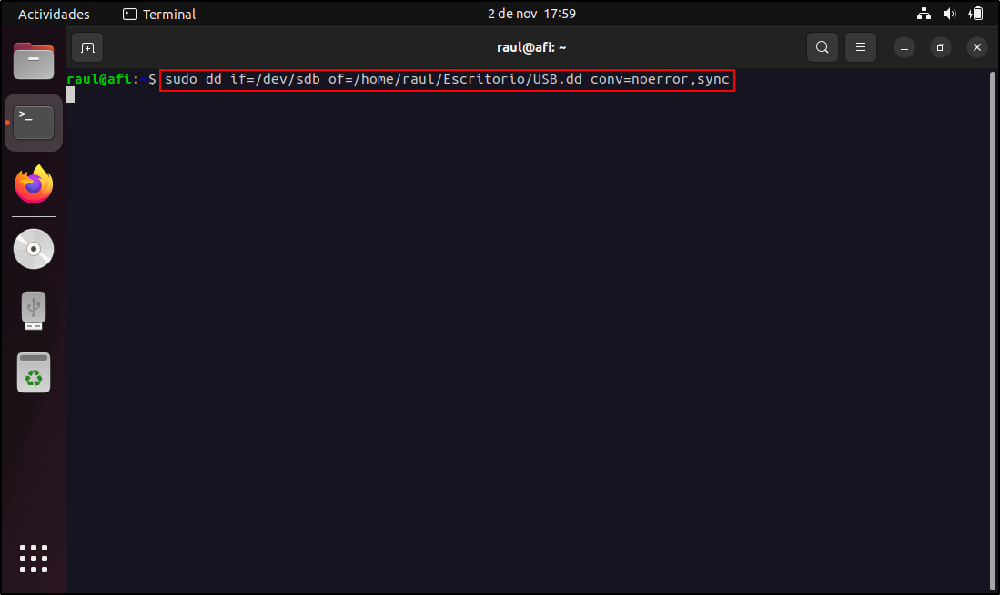
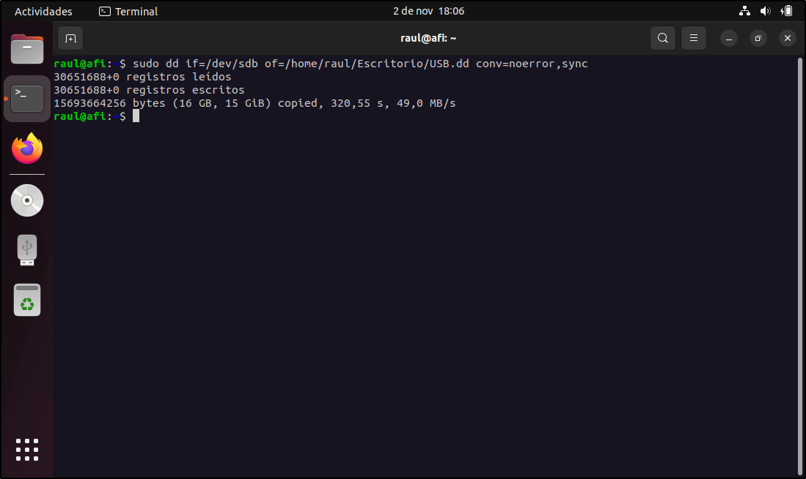
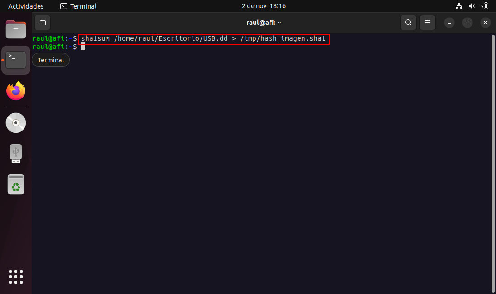
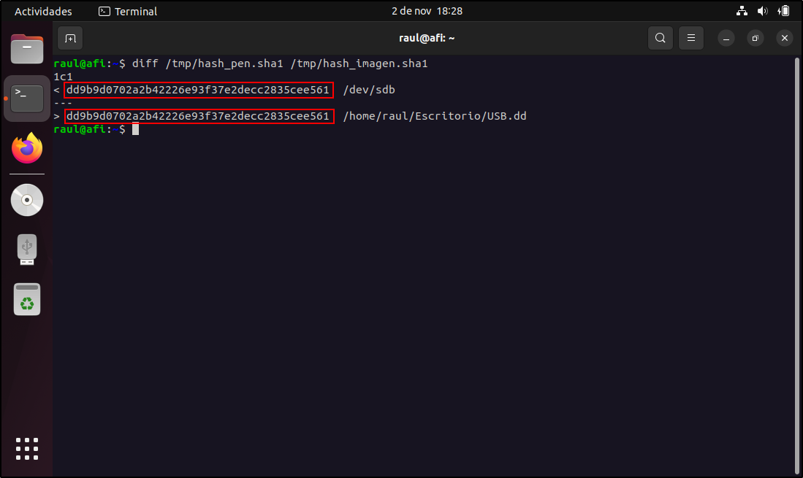

# A05. Realizar la adquisición forense de una memoria USB empleando las siguientes herramientas: FTK Imager, GuyImager y dd

## Índice

## Introducción

En esta actividad realizaré un clonado a bajo nivel (bit a bit) de la memoria USB "Sandisk Extreme" con la ayuda de las herramientas FTK Imager, GuyImager y dd manteniendo la integridad de los datos. Para ello he utilizado dos máquinas virtuales, una con Windows 10 para utilizar FTK Imager y otra con Ubuntu para utilizar GuyImager y el comando dd. Ambas máquinas virtuales se encuentran limpias solo incluyen las herramientas mencionadas.

Información de la memoria USB utilizada:

- Marca: SanDisk
- Modelo: Extreme 
- Sistema: FAT32
- Tamaño: 16GB

## FTK Imager:

Para realizar la adquisición forense mediante la herramienta ***FTK Imager*** le he indicado que la imagen sea de tipo **"Raw (dd)":**  

He marcado las tres opciones que se ven en la captura para que verifique la imagen una vez creada, me muestre las estadísticas mediante el proceso de creación de la imagen y además cree un directorio con todos los fichero de la imagen:

En cuanto al almacenamiento de la imagen, como no dispongo de un disco duro externo, le he indicado que se almacene en la propia máquina aunque no sea lo más recomendable.

Una vez realizada la configuración explicada anteriormente he iniciado la adquisición:

Cuando ha finalizado la creación de la imagen, la herramienta empieza a verificar dicha imagen como le he especificado anteriormente:

Una vez completado el proceso me muestra el resultado de la verificación de la imagen y como se puede observar en la captura, los hash coinciden y no hay ningún bloque defectuoso:

Por último, he decido montar la imagen usando la misma herramienta para comprobar la integridad de la imagen y esta en perfecto estado, además conserva la fecha de creación de los ficheros ya que he realizado una clonación bit a bit:

## GuyImager

Para realizar la adquisición con la herramienta GuyImager, he seleccionado el dispositivo y he pulsado en "adquirir imagen":

La configuración que he realizado es la siguiente:

Le he indicado que el formato de la imagen sea **"Exx"**, el tamaño de la división de la imagen lo he dejado por defecto, le he indicado la ruta donde se almacenará la imagen (No es lo recomendable almacenarla en la misma máquina virtual pero no dispongo de disco duro externo) y por último, le he indicado que calcule los *hashes* de los tres algoritmos disponibles y que verifique la fuente y la imagen despues de crearla:

Una vez configurado, he iniciado la adquisición:

La adquisición ha finalizado y como vemos en la captura, la imagen se ha verificado correctamente y no hay ningún bloque defectuoso:

Por último, para verificar que los hashes coinciden, he abierto el fichero de información que crea al generar la imagen y como se puede observar coinciden:

## Comando dd

Para realizar la adquisición con el comando ***"dd"*** lo primero que hago es generar un *hash* de la memoria USB para después compararlo con el *hash* de la imagen generada. Para ello utilizo el comando mostrando en la captura y el resultado lo almaceno en un fichero:

Procedo a crear la imagen con el comando ***dd***. 
Con la opción ***"conv"*** le indico el parametro ***"noerror"*** para que permita seguir con el proceso de la creación de la imagen aunque de errores y el parámetro ***"sync"*** para que en caso de que un bloque nos de algún error se rellene el resto del bloque con nulos.

Una vez finalizada la adquisición nos muestra información de los registros leidos y escritos y como podemos ver son los mismos por lo que la imagen parece estar correcta:

Ahora procedo a crear el *hash* de la imagen generada de la misma forma que cree la del *pendrive*:

Por último, compruebo el *hash* del *pendrive* y el *hash* de la memoria con la ayuda del comando ***"diff"*** y como se puede observar son exactamente iguales:

## Conclusión 

Tras probar las herramientas y hacer la adquisición forense con cada una de ellas, he podido apreciar algunas diferencias. En cuanto a la velocidad de adquisición, *FTK Imager* ha sido la más lenta, en cuanto a la comprobación de *hashes* la más tediosa es la herramienta *"dd"* ya que tienes que generar los *hashes* manualmente y compararlos, cosa que las otras dos herramientas lo hacen automáticamente si marcas la opción correspondiente, en cuanto a los formatos disponibles, *FTK Imager* te más opciones para elegir ya que *Guy Imager* solo tiene 2 formatos y *dd* solo 1.
Las tres herramientas hacen su función perfectamente por lo que mi elección dependerá del caso en concreto para lo que la vaya a usar. Si lo que quiero es solo hacer la adquisición me decantaría por ***GuyImager*** y si además de realizar la adquisición quiero analizar la imagen me decantaría por ***FTK Imager*** ya que es la más completa y tiene muchas más funcionalidades.
